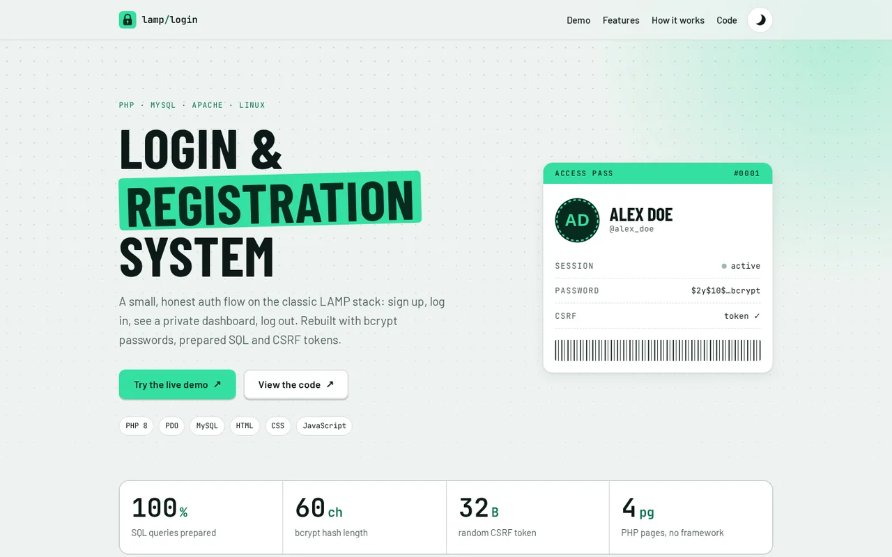

# LAMP Login & Registration System

A secure sign-up / log-in / dashboard flow built with plain PHP 8 and MySQL on the classic LAMP stack, with no framework.

**[▶ Live demo](https://brutall100.github.io/lamp-login-registration/)** · **[Source code](https://github.com/brutall100/lamp-login-registration)**



## About

This started as a basic tutorial login system and was rebuilt with the security basics every
login form needs. The PHP app lives in [`app/`](app/). GitHub Pages can't run PHP, so the
[live demo](https://brutall100.github.io/lamp-login-registration/) runs the same form rules in
JavaScript and keeps demo accounts only in your browser.

## Features

- **Register → log in → dashboard → log out**, with clear error messages
- **bcrypt passwords** through `password_hash()` / `password_verify()` (the old `md5()` is gone)
- **Prepared statements** through PDO for every SQL query
- **CSRF tokens** on every form. Log out is a POST request, not a GET link.
- **XSS-safe output**: all user input goes through `htmlspecialchars()`
- **Hardened sessions**: HttpOnly + SameSite cookies and a new session id after login
- **Light and dark themes**: follows your system setting and remembers what you pick
- **Responsive and accessible**: works at 390 px, has a skip link, visible focus and `prefers-reduced-motion` support
- Live background with a dot grid and a pulsing glow, buttons with a ripple effect, scroll-reveal and count-up numbers

## Built with

| Layer    | Tech                                                    |
| -------- | ------------------------------------------------------- |
| Server   | PHP 8 (PDO), Apache                                     |
| Database | MySQL / MariaDB                                         |
| Frontend | HTML, CSS (custom properties, no framework), vanilla JS |
| Fonts    | Barlow Condensed, Barlow, JetBrains Mono                |

## What I learned

- Why `md5()` is not safe for passwords, and how `password_hash()` adds salt and cost for you
- How prepared statements stop SQL injection, which escaping strings by hand can easily miss
- What CSRF is, and why actions that change state (like logging out) should be POST requests
- Why you need `exit` after a `header('Location: …')` redirect
- How to build a light/dark theme with CSS variables and no flash on page load
- How to animate only `transform` and `opacity` so the page stays smooth

## Run it locally

1. Install **XAMPP** (or any Apache + PHP 8 + MySQL setup).
2. Clone the repo into your web root (for XAMPP that is `htdocs/`):
   ```bash
   git clone https://github.com/brutall100/lamp-login-registration.git
   ```
3. Create the database: open phpMyAdmin → **SQL** and run [`app/database/schema.sql`](app/database/schema.sql),
   or run `mysql -u root < app/database/schema.sql`.
4. If your MySQL user or password is not `root` / empty, edit [`app/config.php`](app/config.php)
   (or set the `DB_DSN`, `DB_USER`, `DB_PASS` environment variables).
5. Open <http://localhost/lamp-login-registration/app/register.php>.

The landing page and browser demo (`index.html`) need no server. Open the file in a browser, or run `npx serve`.

## Project structure

```
lamp-login-registration/
├── index.html              # landing page + browser demo (GitHub Pages)
├── favicon.svg
├── app/                    # the real PHP app
│   ├── config.php          # database settings
│   ├── register.php
│   ├── login.php
│   ├── index.php           # dashboard (logged-in users only)
│   ├── logout.php
│   ├── includes/
│   │   ├── bootstrap.php   # session, PDO, CSRF and escape helpers
│   │   ├── layout-top.php
│   │   ├── layout-bottom.php
│   │   └── alerts.php
│   └── database/
│       └── schema.sql
├── assets/
│   ├── css/style.css       # shared design system
│   └── js/
│       ├── theme-init.js   # applies the saved theme before first paint
│       ├── main.js         # theme toggle, ripple, reveal, count-up
│       └── demo.js         # browser-only demo auth
├── images/
│   └── avatar-alex-doe.svg
└── docs/
    └── screenshot.webp
```

## Credits

- Based on an open-source tutorial login system by [sanchit0496](https://github.com/sanchit0496).
- Fonts: [Barlow, Barlow Condensed](https://fonts.google.com/specimen/Barlow) and
  [JetBrains Mono](https://www.jetbrains.com/lp/mono/) (SIL Open Font License).
- "Alex Doe" is a made-up example profile.
